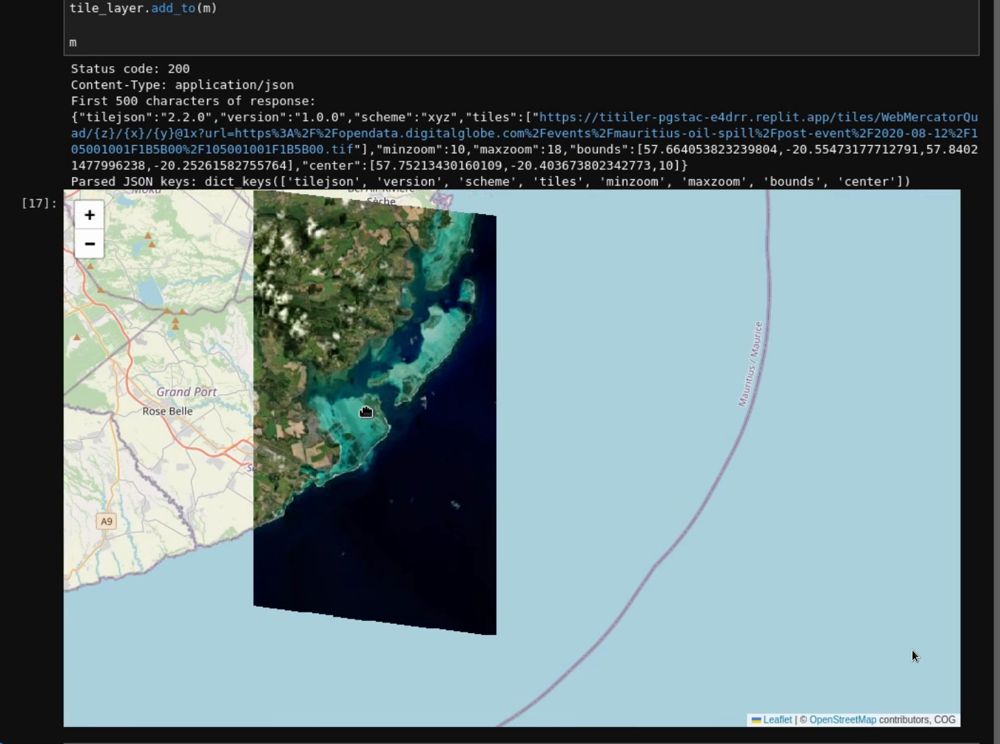
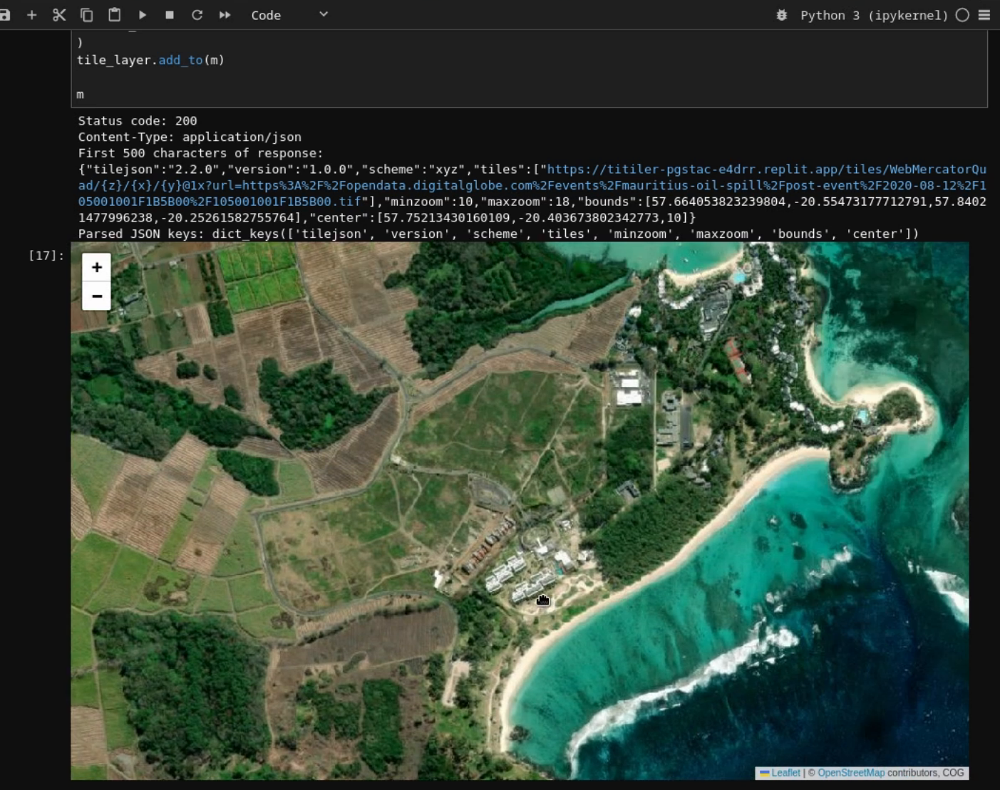

# TiTiler Endpoint Usage Guide

## Overview

This guide demonstrates how to use TiTiler endpoints for working with Cloud Optimized GeoTIFF (COG) files and other geospatial data formats. Based on the [TiTiler documentation](https://developmentseed.org/titiler/examples/notebooks/Working_with_CloudOptimizedGeoTIFF_simple/) and real-world usage examples.

## Base URL Configuration

For this deployment on Replit:
```python
titiler_endpoint = "https://titiler-pgstac-e4drr.replit.app"
```

## COG (Cloud Optimized GeoTIFF) Endpoints

### 1. Dataset Information

Get metadata and information about a COG file:

```python
import httpx

url = "https://opendata.digitalglobe.com/events/mauritius-oil-spill/post-event/2020-08-12/105001001F1B5B00/105001001F1B5B00.tif"

response = httpx.get(
    f"{titiler_endpoint}/cog/info",
    params={"url": url}
)

info = response.json()
print(info)
```

**Response Structure:**
```json
{
  "bounds": [57.664053823239804, -20.55473177712791, 57.84021477996238, -20.25261582755764],
  "crs": "http://www.opengis.net/def/crs/EPSG/0/4326",
  "band_metadata": [["b1", {}], ["b2", {}], ["b3", {}]],
  "band_descriptions": [["b1", ""], ["b2", ""], ["b3", ""]],
  "dtype": "uint8",
  "nodata_type": "Mask",
  "colorinterp": ["red", "green", "blue"],
  "scales": [1.0, 1.0, 1.0],
  "offsets": [0.0, 0.0, 0.0],
  "driver": "GTiff",
  "count": 3,
  "width": 38628,
  "height": 66247,
  "overviews": [2, 4, 8, 16, 32, 64, 128]
}
```

### 2. TileJSON Generation

Generate TileJSON specification for web map integration:

```python
response = httpx.get(
    f"{titiler_endpoint}/cog/WebMercatorQuad/tilejson.json",
    params={"url": url}
)

tilejson = response.json()
```

**TileJSON Structure:**
```json
{
  "tilejson": "2.2.0",
  "version": "1.0.0",
  "scheme": "xyz",
  "tiles": ["https://titiler-pgstac-e4drr.replit.app/cog/tiles/WebMercatorQuad/{z}/{x}/{y}@1x?url=..."],
  "minzoom": 10,
  "maxzoom": 18,
  "bounds": [57.664053823239804, -20.55473177712791, 57.84021477996238, -20.25261582755764],
  "center": [57.75213430160109, -20.403673802342773, 10]
}
```

### 3. Tile Requests

Direct tile access for web maps:

```
GET /cog/tiles/WebMercatorQuad/{z}/{x}/{y}@1x?url={cog_url}
```

**Parameters:**
- `z`: Zoom level
- `x`: Tile X coordinate
- `y`: Tile Y coordinate
- `url`: URL to the COG file
- Optional: `rescale`, `colormap_name`, `return_mask`

## Interactive Map Visualization

### Complete Folium Example

```python
import json
import httpx
from folium import Map, TileLayer

# Configuration
titiler_endpoint = "https://titiler-pgstac-e4drr.replit.app"
cog_url = "https://opendata.digitalglobe.com/events/mauritius-oil-spill/post-event/2020-08-12/105001001F1B5B00/105001001F1B5B00.tif"

# Get dataset info
info_response = httpx.get(
    f"{titiler_endpoint}/cog/info",
    params={"url": cog_url}
)
info = info_response.json()
bounds = info["bounds"]

# Get TileJSON
tilejson_response = httpx.get(
    f"{titiler_endpoint}/cog/WebMercatorQuad/tilejson.json",
    params={"url": cog_url}
)
tilejson = tilejson_response.json()

# Create map centered on data
center_lat = (bounds[1] + bounds[3]) / 2
center_lon = (bounds[0] + bounds[2]) / 2

m = Map(location=[center_lat, center_lon], zoom_start=13)

# Add COG tile layer
tile_layer = TileLayer(
    tiles=tilejson['tiles'][0],
    attr='COG',
    name='Satellite Imagery',
    overlay=True,
    control=True,
    min_zoom=tilejson['minzoom'],
    max_zoom=tilejson['maxzoom']
)
tile_layer.add_to(m)

# Display map
m
```

## Visualization Results

The following images demonstrate the successful visualization of COG data through the TiTiler deployment:

### Mauritius Oil Spill Imagery - Two Views

<div style="display: flex; gap: 20px; margin: 20px 0;">
  <div style="flex: 1;">
    
    <p style="text-align: center; font-style: italic; margin-top: 8px;">
      Coastal area showing oil spill impact with high-resolution satellite imagery
    </p>
  </div>
  <div style="flex: 1;">
    
    <p style="text-align: center; font-style: italic; margin-top: 8px;">
      Detailed view showing environmental damage and coastal features
    </p>
  </div>
</div>

**Key Observations:**
- ✅ High-resolution imagery successfully rendered through TiTiler
- ✅ Proper tile generation with seamless zoom levels
- ✅ Accurate geographic positioning and coordinate system handling
- ✅ Clear visualization of environmental features and damage assessment

## Advanced Usage Patterns

### 1. Band Manipulation

Access specific bands or create band combinations:

```python
# RGB composite (default)
tile_url = f"{titiler_endpoint}/cog/tiles/WebMercatorQuad/{{z}}/{{x}}/{{y}}@1x?url={cog_url}"

# Custom band combination
tile_url = f"{titiler_endpoint}/cog/tiles/WebMercatorQuad/{{z}}/{{x}}/{{y}}@1x?url={cog_url}&bidx=3,2,1"

# Single band
tile_url = f"{titiler_endpoint}/cog/tiles/WebMercatorQuad/{{z}}/{{x}}/{{y}}@1x?url={cog_url}&bidx=1"
```

### 2. Color Enhancement

Apply rescaling and color maps:

```python
# Rescale values
tile_url = f"{titiler_endpoint}/cog/tiles/WebMercatorQuad/{{z}}/{{x}}/{{y}}@1x?url={cog_url}&rescale=0,255"

# Apply colormap
tile_url = f"{titiler_endpoint}/cog/tiles/WebMercatorQuad/{{z}}/{{x}}/{{y}}@1x?url={cog_url}&colormap_name=viridis"

# Combined parameters
tile_url = f"{titiler_endpoint}/cog/tiles/WebMercatorQuad/{{z}}/{{x}}/{{y}}@1x?url={cog_url}&rescale=0,100&colormap_name=plasma&bidx=1"
```

### 3. Preview Generation

Generate preview images for quick visualization:

```python
# Full dataset preview
preview_url = f"{titiler_endpoint}/cog/preview.png?url={cog_url}"

# Custom size preview
preview_url = f"{titiler_endpoint}/cog/preview.png?url={cog_url}&width=512&height=512"

# Preview with enhancements
preview_url = f"{titiler_endpoint}/cog/preview.png?url={cog_url}&rescale=0,255&colormap_name=terrain"
```

## STAC Integration Endpoints

### Collections and Items

```python
# List collections
collections = httpx.get(f"{titiler_endpoint}/collections").json()

# Get specific collection
collection = httpx.get(f"{titiler_endpoint}/collections/{{collection_id}}").json()

# List items in collection
items = httpx.get(f"{titiler_endpoint}/collections/{{collection_id}}/items").json()

# Get tiles from STAC item
tile_url = f"{titiler_endpoint}/collections/{{collection_id}}/items/{{item_id}}/tiles/WebMercatorQuad/{{z}}/{{x}}/{{y}}"
```

## Multidimensional Data Endpoints

For Zarr/NetCDF datasets:

```python
# Dataset information
dataset_info = httpx.get(f"{titiler_endpoint}/md/info?url={{zarr_url}}").json()

# Available variables
variables = httpx.get(f"{titiler_endpoint}/md/variables?url={{zarr_url}}").json()

# Generate tiles for specific variable
tile_url = f"{titiler_endpoint}/md/tiles/WebMercatorQuad/{{z}}/{{x}}/{{y}}?url={{zarr_url}}&variable=temperature"
```

## Error Handling and Best Practices

### Robust Request Handling

```python
import httpx
import time
from typing import Optional

def get_tilejson_robust(titiler_endpoint: str, cog_url: str, max_retries: int = 3) -> Optional[dict]:
    """Get TileJSON with retry logic and error handling."""
    
    for attempt in range(max_retries):
        try:
            response = httpx.get(
                f"{titiler_endpoint}/cog/WebMercatorQuad/tilejson.json",
                params={"url": cog_url},
                timeout=30.0
            )
            
            if response.status_code == 200:
                return response.json()
            else:
                print(f"HTTP {response.status_code}: {response.text}")
                
        except httpx.TimeoutException:
            print(f"Timeout on attempt {attempt + 1}")
        except Exception as e:
            print(f"Error on attempt {attempt + 1}: {e}")
        
        if attempt < max_retries - 1:
            time.sleep(2 ** attempt)  # Exponential backoff
    
    return None

# Usage
tilejson = get_tilejson_robust(titiler_endpoint, cog_url)
if tilejson:
    print("Successfully retrieved TileJSON")
else:
    print("Failed to retrieve TileJSON after retries")
```

### Performance Optimization

```python
# Use connection pooling for multiple requests
client = httpx.Client(timeout=30.0)

try:
    # Multiple requests with same client
    info = client.get(f"{titiler_endpoint}/cog/info", params={"url": cog_url}).json()
    tilejson = client.get(f"{titiler_endpoint}/cog/WebMercatorQuad/tilejson.json", params={"url": cog_url}).json()
    
finally:
    client.close()
```

## Testing Endpoints

### Health Checks

```python
# Service health
health = httpx.get(f"{titiler_endpoint}/health").json()
print(f"Service status: {health['status']}")

# Proxy health (if using Nginx)
proxy_health = httpx.get(f"{titiler_endpoint}/health/proxy").json()
```

### Validation Script

```python
def validate_titiler_deployment(endpoint: str, test_cog_url: str) -> bool:
    """Validate TiTiler deployment functionality."""
    
    tests = [
        ("Health Check", f"{endpoint}/health"),
        ("API Documentation", f"{endpoint}/docs"),
        ("COG Info", f"{endpoint}/cog/info?url={test_cog_url}"),
    ]
    
    results = {}
    
    for test_name, url in tests:
        try:
            response = httpx.get(url, timeout=10)
            results[test_name] = response.status_code == 200
            print(f"✅ {test_name}: {'PASS' if results[test_name] else 'FAIL'}")
        except Exception as e:
            results[test_name] = False
            print(f"❌ {test_name}: FAIL - {e}")
    
    return all(results.values())

# Run validation
test_cog = "https://opendata.digitalglobe.com/events/mauritius-oil-spill/post-event/2020-08-12/105001001F1B5B00/105001001F1B5B00.tif"
is_valid = validate_titiler_deployment(titiler_endpoint, test_cog)
print(f"\nDeployment validation: {'PASSED' if is_valid else 'FAILED'}")
```

This comprehensive guide demonstrates the successful integration of TiTiler with real-world geospatial data, showcasing both the technical implementation and practical visualization results achieved through the Replit deployment.
